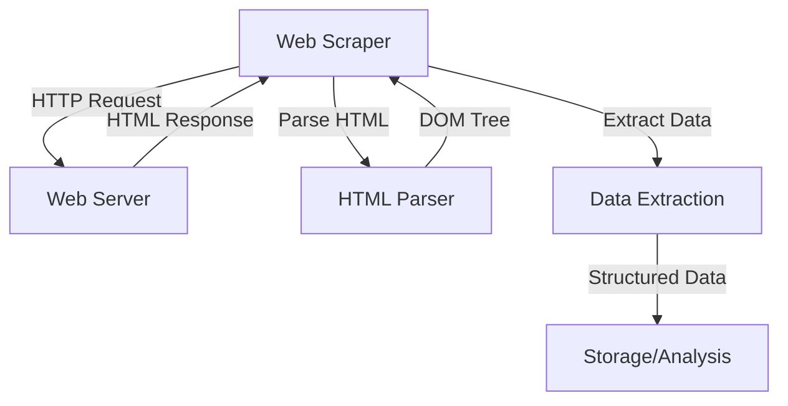
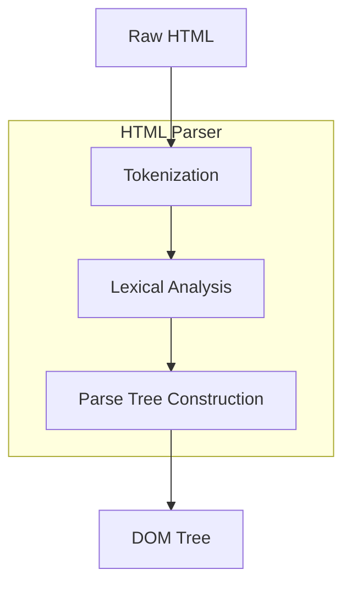
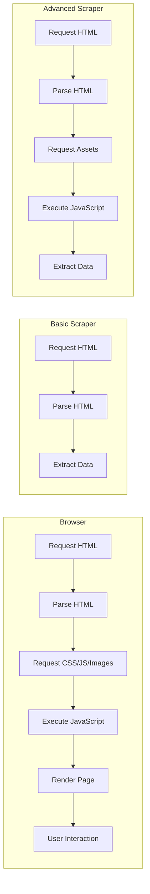
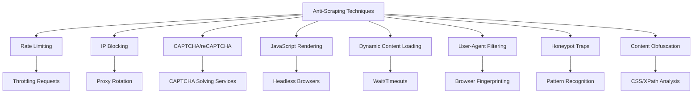
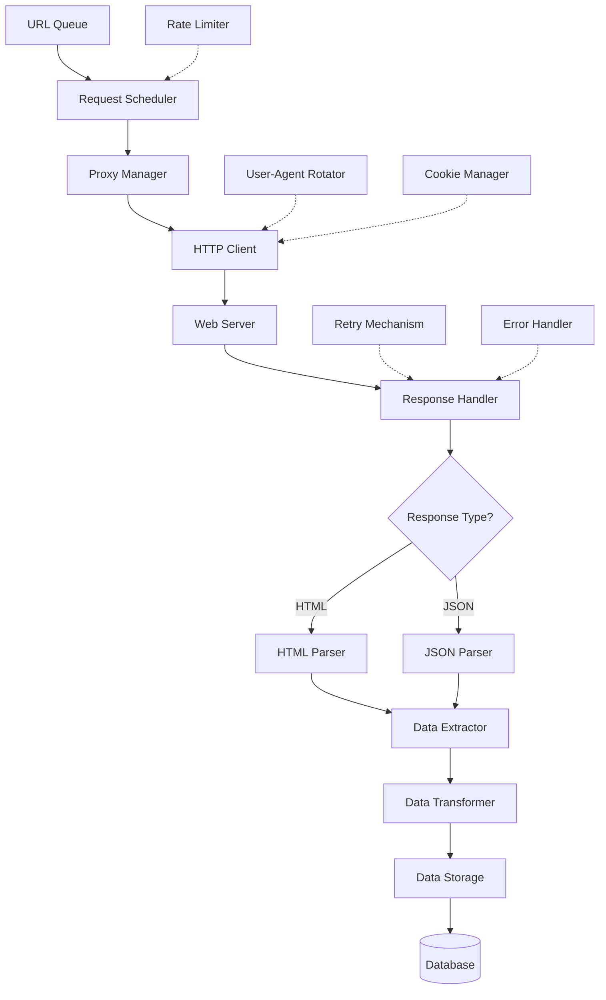
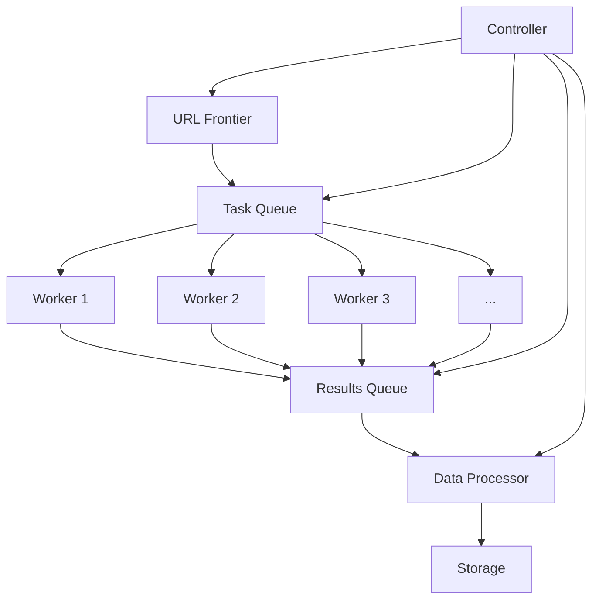

## What is Web Scraping?

Web scraping is the automated extraction of data from websites. Instead of manually copying information, we use code to request web pages, download their content, and extract the specific data we need.

## Core Components of Web Scraping

### 1. HTTP Request/Response Cycle

When you scrape a website, you first initiate an HTTP request to the server hosting the website.

```
CLIENT                                SERVER
  |                                     |
  |------ GET /page.html HTTP/1.1 ----->|
  |       Host: example.com             |
  |       User-Agent: MyScraper/1.0     |
  |                                     |
  |<---- HTTP/1.1 200 OK --------------|
  |      Content-Type: text/html        |
  |      Content-Length: 1234           |
  |                                     |
  |      <!DOCTYPE html>                |
  |      <html>...</html>               |
  |                                     |
```

Important components:

- **HTTP Method**: Usually GET for scraping (sometimes POST for forms)
- **Headers**: Crucial for mimicking browser behavior
    - User-Agent: Identifies your scraper to the website
    - Accept-Language: Language preferences
    - Referer: Where the request came from
    - Cookies: For maintaining sessions

### 2. HTML Parsing

Once you receive the HTML response, you need to parse it to create a structured representation:


The parser transforms raw HTML text into a Document Object Model (DOM) - a tree structure where each node represents an HTML element.

### 3. Data Extraction

After parsing, you can extract specific data using various selection methods:

```
                  DOM Tree
                     |
    +----------------+---------------+
    |                |               |
CSS Selectors    XPath         RegEx Pattern
    |                |               |
    v                v               v
 .article       //div[@class=     "price: 
   h2             "product"]        \$\d+"
    |                |               |
    +----------------+---------------+
                     |
              Extracted Data
```

Common data extraction methods:

- **CSS Selectors**: `soup.select('div.product h2.title')`
- **XPath**: `//div[@class="product"]/h2[@class="title"]/text()`
- **Regular Expressions**: For pattern matching in text

## The Browser Rendering Process vs. Web Scraping

To fully understand web scraping, it's important to compare it with how browsers render pages:



Key differences:

- **Basic scrapers** just download and parse HTML
- **Browsers** download assets, execute JavaScript, and render visually
- **Advanced scrapers** (using headless browsers) can behave more like real browsers

## Technical Implementation: Tools and Libraries

Let's explore the main technologies used for web scraping:

### Python Ecosystem

```
+-------------------+    +-------------------+    +-------------------+
|   HTTP Clients    |    |   HTML Parsers    |    | Browser Automation|
+-------------------+    +-------------------+    +-------------------+
| - Requests        |    | - BeautifulSoup   |    | - Selenium        |
| - HTTPX           |    | - lxml            |    | - Playwright      |
| - aiohttp         |    | - html5lib        |    | - Puppeteer (JS)  |
+-------------------+    +-------------------+    +-------------------+
```

### JavaScript Ecosystem

```
+-------------------+    +-------------------+    +-------------------+
|   HTTP Clients    |    |   HTML Parsers    |    | Browser Automation|
+-------------------+    +-------------------+    +-------------------+
| - Axios           |    | - Cheerio         |    | - Puppeteer       |
| - node-fetch      |    | - JSDOM           |    | - Playwright      |
| - got             |    |                   |    |                   |
+-------------------+    +-------------------+    +-------------------+
```

## Challenges in Web Scraping

### 1. Anti-Scraping Techniques

Websites employ various defenses against scrapers:



### 2. Dynamic Content

Modern websites often load content dynamically using JavaScript:

```
Initial HTML                     After JavaScript Execution
+------------------+             +------------------+
| <!DOCTYPE html>  |             | <!DOCTYPE html>  |
| <html>           |             | <html>           |
|   <head>...</head>|             |   <head>...</head>|
|   <body>         |             |   <body>         |
|     <div id="app">|    ==>      |     <div id="app">|
|     </div>       |             |       <header>...</header>
|     <script src= |             |       <main>...</main>
|     "app.js">    |             |       <footer>...</footer>
|     </script>    |             |     </div>       |
|   </body>        |             |   </body>        |
| </html>          |             | </html>          |
+------------------+             +------------------+
```

Basic scrapers only see the initial HTML, requiring headless browsers to fully render the page.

## Detailed Web Scraping Architecture

Let's look at a comprehensive architecture for a robust web scraping system:



## Code Example: Basic Web Scraper

Here's a basic Python web scraper using Requests and BeautifulSoup:

```python
import requests
from bs4 import BeautifulSoup
import time
import random

def scrape_product_page(url):
    # Add delay to avoid rate limiting
    time.sleep(random.uniform(1, 3))
    
    # Set headers to mimic a browser
    headers = {
        'User-Agent': 'Mozilla/5.0 (Windows NT 10.0; Win64; x64) AppleWebKit/537.36 (KHTML, like Gecko) Chrome/91.0.4472.124 Safari/537.36',
        'Accept-Language': 'en-US,en;q=0.9',
        'Referer': 'https://www.google.com/'
    }
    
    # Send HTTP request
    response = requests.get(url, headers=headers)
    
    # Check if request was successful
    if response.status_code == 200:
        # Parse HTML
        soup = BeautifulSoup(response.text, 'html.parser')
        
        # Extract data using CSS selectors
        product_name = soup.select_one('h1.product-title').text.strip()
        price = soup.select_one('span.price').text.strip()
        description = soup.select_one('div.description').text.strip()
        
        # Return structured data
        return {
            'name': product_name,
            'price': price,
            'description': description,
            'url': url
        }
    else:
        print(f"Failed to retrieve page: {response.status_code}")
        return None

# Example usage
product_urls = [
    'https://example.com/product/1',
    'https://example.com/product/2',
    'https://example.com/product/3'
]

products = []
for url in product_urls:
    product_data = scrape_product_page(url)
    if product_data:
        products.append(product_data)

print(f"Successfully scraped {len(products)} products")
```

## Code Example: Advanced Scraper with Headless Browser

For websites with dynamic content:

```python
from playwright.sync_api import sync_playwright
import time

def scrape_dynamic_content(url):
    with sync_playwright() as p:
        # Launch browser
        browser = p.chromium.launch(headless=True)
        
        # Create a new page
        page = browser.new_page()
        
        # Set user agent
        page.set_extra_http_headers({
            'User-Agent': 'Mozilla/5.0 (Windows NT 10.0; Win64; x64) AppleWebKit/537.36 (KHTML, like Gecko) Chrome/91.0.4472.124 Safari/537.36'
        })
        
        # Navigate to URL
        page.goto(url)
        
        # Wait for content to load
        page.wait_for_selector('.product-container')
        
        # Sometimes need to scroll to trigger lazy loading
        page.evaluate("window.scrollTo(0, document.body.scrollHeight)")
        time.sleep(2)  # Allow time for any animations or additional content to load
        
        # Extract data
        product_name = page.query_selector('h1.product-title').inner_text()
        price = page.query_selector('span.price').inner_text()
        
        # Click a button to reveal more content if needed
        show_more_button = page.query_selector('button.show-more')
        if show_more_button:
            show_more_button.click()
            page.wait_for_selector('div.additional-content')
        
        # Get additional content
        description = page.query_selector('div.description').inner_text()
        
        # Close browser
        browser.close()
        
        return {
            'name': product_name,
            'price': price,
            'description': description,
            'url': url
        }

# Example usage
product_data = scrape_dynamic_content('https://example.com/dynamic-product/1')
print(product_data)
```

## Ethical and Legal Considerations

Web scraping comes with important ethical and legal considerations:

1. **Terms of Service**: Always check a website's ToS/robots.txt
2. **Rate Limiting**: Don't overload servers with requests
3. **Personal Data**: Be careful with scraping personal information (GDPR, CCPA)
4. **Copyright**: Respect copyright for content you scrape
5. **API Availability**: Use official APIs when available

## Advanced Topics in Web Scraping

### 1. Distributed Scraping

For large-scale projects:



### 2. Handling Authentication

Many websites require login:

```
+-------------------+    +-------------------+    +-------------------+
|  Initial Request  |    |  Login Process    |    |  Authenticated    |
|                   |    |                   |    |    Requests       |
+-------------------+    +-------------------+    +-------------------+
| 1. GET Login Page |    | 3. POST Login Form|    | 5. GET Protected  |
| 2. Store Cookies  |    | 4. Store Session  |    |    Resources      |
|    & CSRF Token   |    |    Cookies        |    |                   |
+-------------------+    +-------------------+    +-------------------+
```

### 3. Scraping APIs

Many modern websites load data via API calls:

```
Website                      Your Scraper
  |                            |
  |---- GET /page.html ------->|
  |<--- 200 OK --------------- |
  |                            |
  |                            | Analyze Network Traffic
  |                            | 
  |---- GET /api/products ---->|
  |<--- 200 OK {"data":[...]}  |
  |                            |
  |                            | Extract directly 
  |                            | from API response
```

## Conclusion

Web scraping is a powerful technique that involves:

1. Making HTTP requests to web servers
2. Parsing returned HTML/JSON
3. Extracting and structuring data
4. Managing challenges like rate limiting and dynamic content
5. Scaling with distributed systems for larger projects

Understanding both the technical aspects and ethical considerations will help you build effective and responsible web scrapers. As you continue learning, I recommend experimenting with different libraries and tackling increasingly complex websites to build your skills.

Would you like me to go into more detail on any specific part of the web scraping process?
