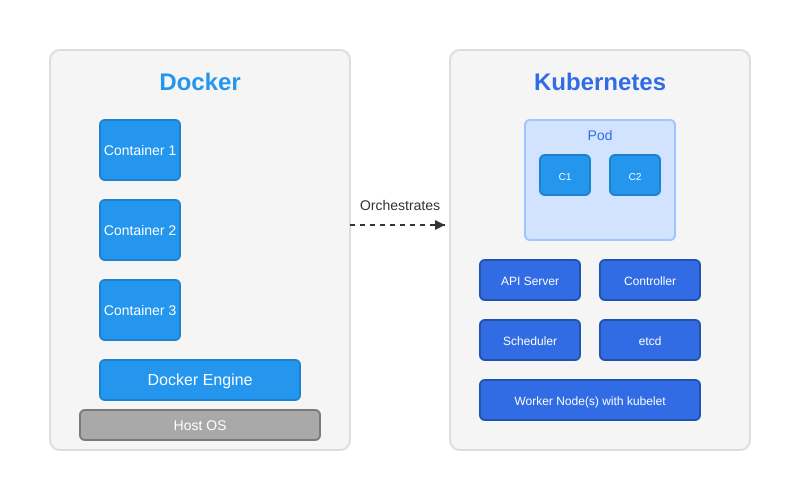
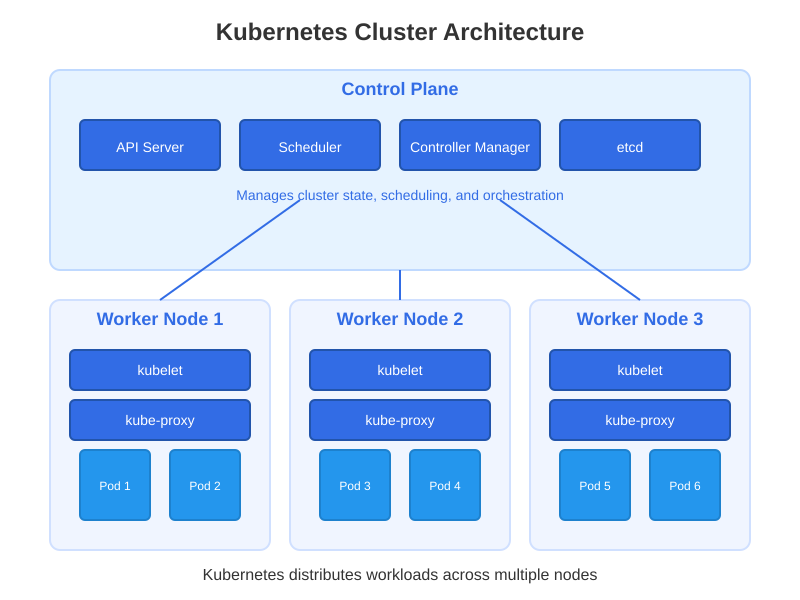
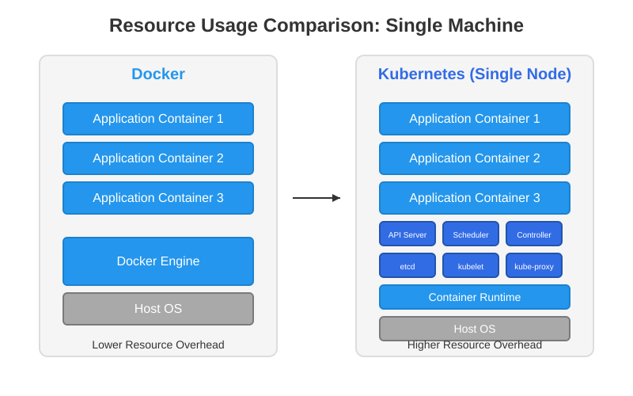
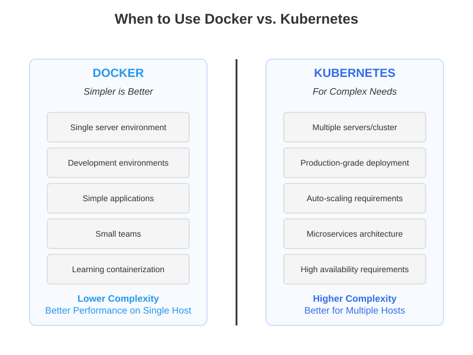
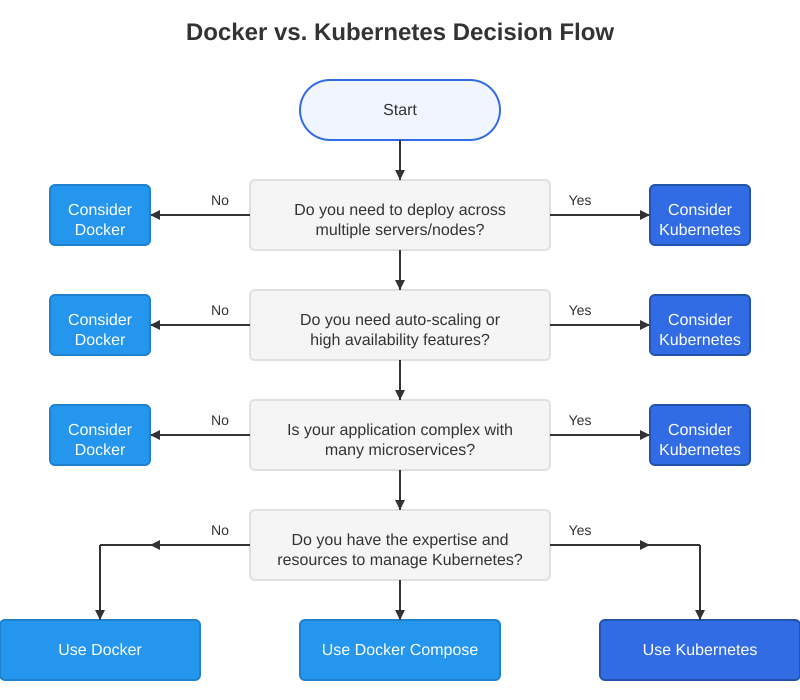
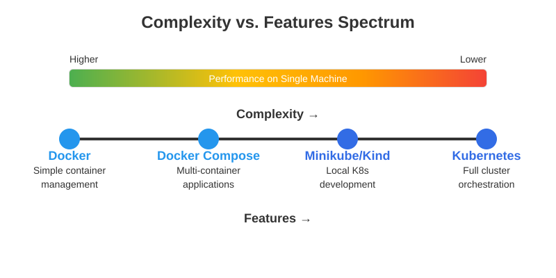

I'll explain the differences between Docker and Kubernetes with diagrams, and help clarify when Kubernetes might be the right choice for your needs.

## Fundamental Differences

Docker is a containerization platform that packages applications and their dependencies into isolated units called containers. Kubernetes is an orchestration system that automates the deployment, scaling, and management of containerized applications.

Let me create a diagram to illustrate this relationship:

## Key Differences

1. **Purpose**:
    
    - **Docker**: Creates and runs containers on a single host
    - **Kubernetes**: Orchestrates containers across multiple hosts (nodes)
2. **Scale**:
    
    - **Docker**: Best for simple applications, development environments
    - **Kubernetes**: Designed for complex, distributed applications
3. **Architecture**:
    
    - **Docker**: Consists of Docker Engine, container runtime
    - **Kubernetes**: Complex with control plane (API server, scheduler, etc.) and nodes

Let's look at how Kubernetes orchestrates containers across a cluster:

## When to Use Kubernetes vs. Docker

Let's address your specific questions about when to use Kubernetes:

### Is Kubernetes Useful for a Single Machine?

Generally, **Kubernetes is overkill for a single machine** when compared to Docker alone. Here's why:

1. **Complexity**: Kubernetes adds significant complexity in terms of setup, maintenance, and management
2. **Resource Overhead**: Kubernetes requires additional resources to run its control plane components
3. **Learning Curve**: Docker is much easier to learn and use for simple applications

For single-machine use cases, Docker or Docker Compose provides sufficient functionality with less overhead.

### Will Kubernetes Show Better Performance than Docker on the Same Machine?

No, Kubernetes will likely show **worse performance** than Docker alone on a single machine because:

1. **Resource Consumption**: Kubernetes components (API server, etcd, etc.) consume CPU and memory
2. **Networking Overhead**: The Kubernetes networking layer adds overhead
3. **Design Purpose**: Kubernetes was designed for distributed environments, not performance optimization on a single host

Let me illustrate the overhead comparison with a diagram:

## When Kubernetes _Should_ Be Used

Kubernetes becomes beneficial and potentially necessary when:

1. **Multiple Hosts**: You need to manage containers across multiple servers
2. **High Availability**: You require high availability and fault tolerance
3. **Auto-scaling**: Your application needs to scale automatically based on load
4. **Complex Deployments**: You need advanced deployment strategies (rolling updates, canary, blue/green)
5. **Service Discovery**: You require automatic service discovery and load balancing
6. **Resource Optimization**: You want to optimize resource usage across multiple machines

Here's a diagram showing when Docker or Kubernetes might be more appropriate:

## Summary and Recommendations

To directly answer your questions:

1. **Is Kubernetes useful for a single machine?** Not particularly - it adds unnecessary complexity and overhead compared to using Docker directly.
    
2. **Will Kubernetes show better performance than Docker on the same machine?** No, Kubernetes will generally have worse performance on a single machine compared to Docker alone due to the additional resource overhead from its control plane components.
    
3. **When should Kubernetes be used?** Kubernetes is best used when:
    
    - Managing applications across multiple servers/nodes
    - Requiring high availability and fault tolerance
    - Needing automatic scaling capabilities
    - Deploying complex microservice architectures
    - Requiring sophisticated load balancing and service discovery

## Practical Decision Framework

Let me provide a more concrete decision framework for choosing between Docker and Kubernetes:

## Minikube and Kind: Single-Node Kubernetes Options

If you're interested in learning Kubernetes or testing in a smaller environment, there are lighter-weight implementations designed for single machines:

1. **Minikube**: Creates a single-node Kubernetes cluster inside a VM on your local machine
2. **Kind (Kubernetes IN Docker)**: Runs Kubernetes nodes as Docker containers
3. **K3s/k3d**: Lightweight Kubernetes distribution with lower resource requirements

These tools allow you to learn and test Kubernetes functionality without requiring a full multi-server deployment, but they still come with overhead compared to plain Docker.

## Docker Compose: The Middle Ground

For single-machine applications that need more orchestration capabilities than plain Docker but don't warrant Kubernetes complexity, Docker Compose offers a good middle ground:

## Final Recommendations

Based on your questions, here are my final recommendations:

1. **For single-machine deployments**:
    
    - Use Docker or Docker Compose for better performance and lower complexity
    - Docker Compose provides multi-container orchestration capabilities without Kubernetes overhead
2. **When to choose Kubernetes**:
    
    - When you need to deploy across multiple servers
    - When your requirements include high availability, auto-scaling, and advanced networking
    - When you have the expertise and resources to manage the additional complexity
3. **For learning purposes**:
    
    - Start with Docker to understand containerization fundamentals
    - Progress to Docker Compose to learn multi-container applications
    - Use Minikube or Kind to learn Kubernetes concepts in a simplified environment
    - Move to full Kubernetes when you have a real need for its capabilities

Remember that Kubernetes was designed specifically for distributed, multi-node environments. On a single machine, you're only adding overhead without gaining the core benefits Kubernetes was built to provide.

Would you like me to elaborate on any specific aspect of the Docker vs. Kubernetes comparison?
