Scenario
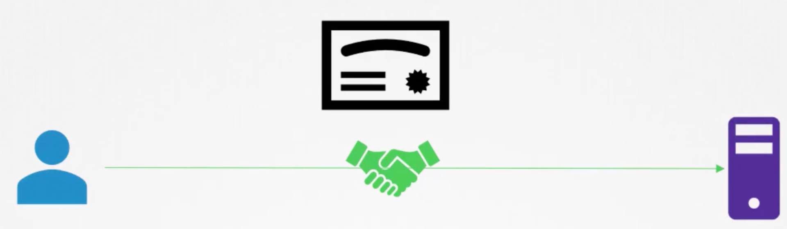
The hacker can easily steal the credentials if the communication is not encrypted.
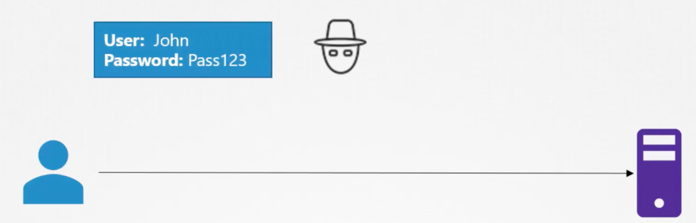

Symmetric Encryption

So we have to do the encryption with a key and the hacker does not know what the credentials are. But so is the server.
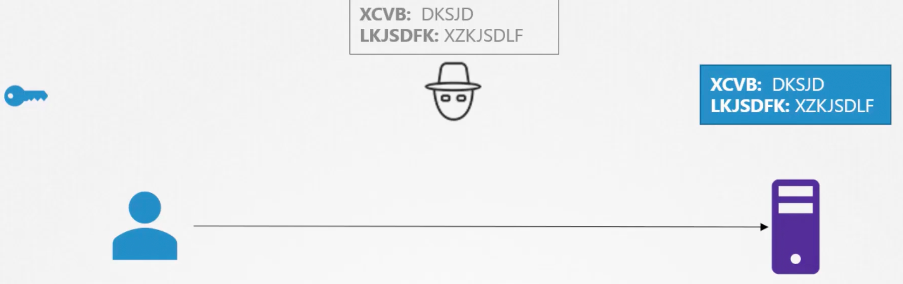

Send over the key? Maybe…
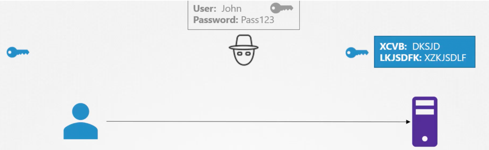

This is what we call Symmetric Encryption.

Asymmetric Encryption
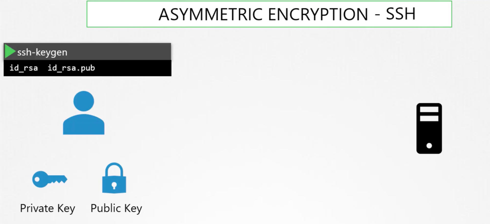
Back to the scenario

The server gives the user its public key.

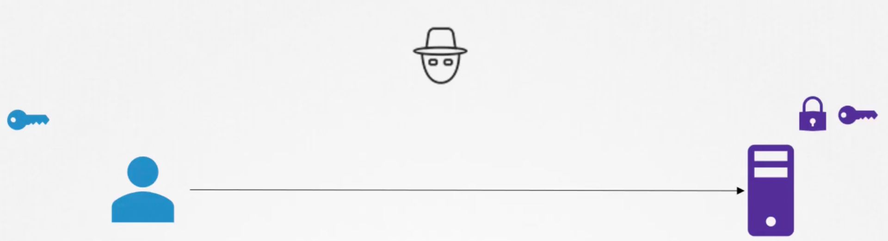

The user encrypts its key with the public key and sends it back to the server.
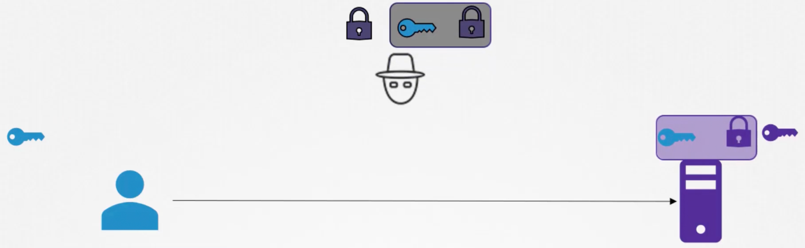
What should the hack do?
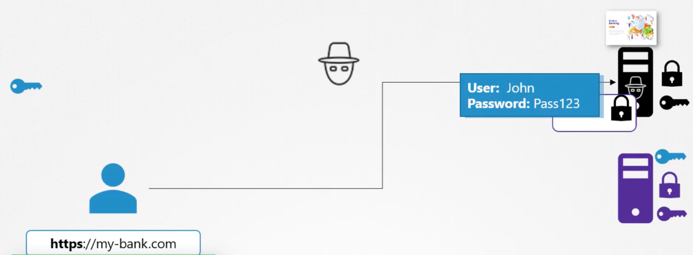

The key should be sent with a certificate to prove the site is [my-bank.com](http://my-bank.com). But the hacker can self-sign a certificate too.

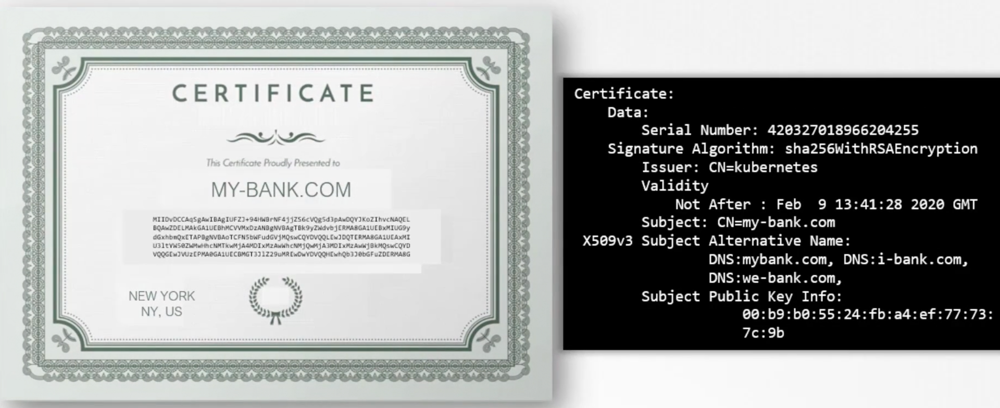

This is where Certificate Authority (CA) comes in.
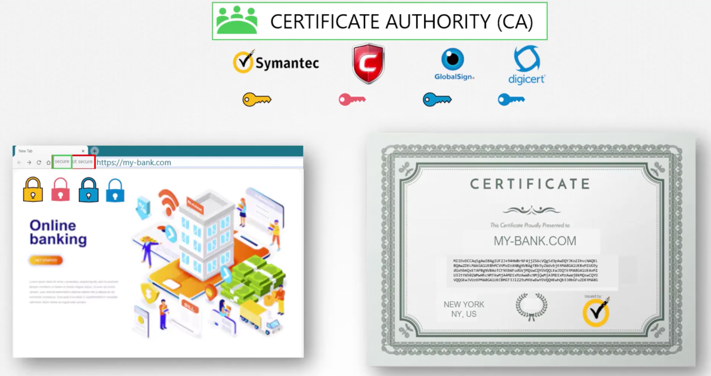
The certificate guarantees:

1. the communication is encrypted.
    
2. the server is who it says it is.
    

Naming convention

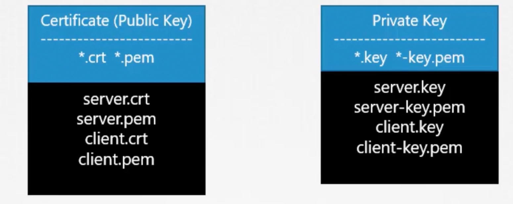
