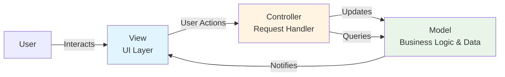
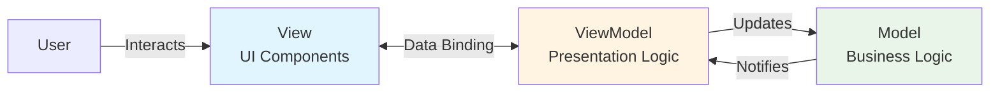

## Introduction

Model-View-Controller (MVC) and Model-View-ViewModel (MVVM) are architectural patterns that have stood the test of time, powering approximately **90% of modern applications**. These patterns provide clear separation of concerns by dividing application logic into distinct, maintainable layers. Whether you're building a React frontend or a Spring Boot backend, understanding these patterns is essential for creating scalable, testable applications.

**Real-world examples:** Netflix (content management), Spotify (desktop/mobile apps), virtually all banking applications

---

## Architecture Overview

### MVC Architecture



### MVVM Architecture



**Key Difference:** MVVM uses **data binding** between View and ViewModel, eliminating manual DOM manipulation and creating a more reactive architecture.

---

## Core Concepts

### Layer Responsibilities

```
┌─────────────────────────────────────────────────┐
│                    VIEW                         │
│  • User Interface (React, Angular, HTML)        │
│  • Displays data from ViewModel/Controller      │
│  • Captures user input                          │
│  • No business logic                            │
└─────────────────────────────────────────────────┘
                      ↕
┌─────────────────────────────────────────────────┐
│              VIEWMODEL/CONTROLLER               │
│  • Presentation logic                           │
│  • State management                             │
│  • Input validation (presentation-level)        │
│  • Coordinates between View and Model           │
└─────────────────────────────────────────────────┘
                      ↕
┌─────────────────────────────────────────────────┐
│                   MODEL                         │
│  • Business logic and rules                     │
│  • Data structures                              │
│  • Data persistence operations                  │
│  • Domain-specific operations                   │
└─────────────────────────────────────────────────┘
```

---

## Frontend Implementation: MVVM with TypeScript/React

### Real-world Use Case: E-commerce Product Catalog

#### Data Flow Diagram

```
┌──────────────┐
│     User     │
│  (searches)  │
└──────┬───────┘
       │
       ▼
┌──────────────────────┐
│   View Component     │◄────┐
│  (ProductListView)   │     │
└──────┬───────────────┘     │
       │                     │ Observable
       │ Action              │ Updates
       ▼                     │
┌──────────────────────┐     │
│     ViewModel        │─────┘
│ (ProductListVM)      │
│  • products[]        │
│  • searchTerm        │
│  • filteredProducts  │
└──────┬───────────────┘
       │
       │ Calls
       ▼
┌──────────────────────┐
│       Model          │
│  (ProductModel)      │
│  • getProducts()     │
│  • business rules    │
└──────┬───────────────┘
       │
       ▼
┌──────────────────────┐
│    API Service       │
└──────────────────────┘
```

#### Implementation

```typescript
// Model - Data structures and business logic
interface Product {
  id: string;
  name: string;
  price: number;
  description: string;
  categoryId: string;
  inStock: boolean;
}

interface CartItem {
  productId: string;
  quantity: number;
  price: number;
}

// Model with business logic
class ProductModel {
  constructor(private apiService: ApiService) {}

  async getProducts(categoryId?: string): Promise<Product[]> {
    const products = await this.apiService.fetchProducts(categoryId);
    return products.filter(p => p.inStock); // Business rule: only show in-stock items
  }

  calculateDiscountPrice(product: Product, discountPercent: number): number {
    return product.price * (1 - discountPercent / 100);
  }

  isEligibleForFreeShipping(cartTotal: number): boolean {
    return cartTotal >= 50; // Business rule
  }
}

// ViewModel - Presentation logic and state management
class ProductListViewModel {
  @observable products: Product[] = [];
  @observable loading = false;
  @observable selectedCategory = 'all';
  @observable searchTerm = '';

  constructor(private productModel: ProductModel) {}

  @computed get filteredProducts(): Product[] {
    return this.products.filter(product =>
      product.name.toLowerCase().includes(this.searchTerm.toLowerCase()) &&
      (this.selectedCategory === 'all' || product.categoryId === this.selectedCategory)
    );
  }

  @computed get totalProducts(): number {
    return this.filteredProducts.length;
  }

  @action async loadProducts(): Promise<void> {
    this.loading = true;
    try {
      this.products = await this.productModel.getProducts();
    } catch (error) {
      console.error('Failed to load products:', error);
    } finally {
      this.loading = false;
    }
  }

  @action setSearchTerm(term: string): void {
    this.searchTerm = term;
  }

  @action setCategory(categoryId: string): void {
    this.selectedCategory = categoryId;
  }
}

// View - React component
const ProductListView: React.FC = observer(() => {
  const viewModel = useViewModel(ProductListViewModel);

  useEffect(() => {
    viewModel.loadProducts();
  }, []);

  return (
    <div className="product-catalog">
      {/* Search and filters */}
      <div className="filters">
        <input
          type="text"
          placeholder="Search products..."
          value={viewModel.searchTerm}
          onChange={(e) => viewModel.setSearchTerm(e.target.value)}
        />
        <select
          value={viewModel.selectedCategory}
          onChange={(e) => viewModel.setCategory(e.target.value)}
        >
          <option value="all">All Categories</option>
          <option value="electronics">Electronics</option>
          <option value="clothing">Clothing</option>
        </select>
      </div>

      {/* Results */}
      {viewModel.loading ? (
        <div>Loading products...</div>
      ) : (
        <div className="product-grid">
          <div className="results-count">
            Found {viewModel.totalProducts} products
          </div>
          {viewModel.filteredProducts.map(product => (
            <ProductCard key={product.id} product={product} />
          ))}
        </div>
      )}
    </div>
  );
});
```

---

## Backend Implementation: MVC with Java/Spring Boot

### Real-world Use Case: Banking Account Management System

#### Request Flow Diagram

```
HTTP Request
     │
     ▼
┌─────────────────────────────────────────┐
│         Controller Layer                │
│  • AccountController                    │
│  • Validates HTTP requests              │
│  • Maps DTOs to domain objects          │
│  • Returns HTTP responses               │
└─────────────┬───────────────────────────┘
              │
              ▼
┌─────────────────────────────────────────┐
│         Service Layer                   │
│  • AccountService                       │
│  • Business logic orchestration         │
│  • Transaction management               │
│  • Calls multiple repositories          │
└─────────────┬───────────────────────────┘
              │
              ▼
┌─────────────────────────────────────────┐
│         Model/Entity Layer              │
│  • Account (domain entity)              │
│  • Business rules (deposit, withdraw)   │
│  • Domain validations                   │
└─────────────┬───────────────────────────┘
              │
              ▼
┌─────────────────────────────────────────┐
│         Repository Layer                │
│  • AccountRepository                    │
│  • Data access abstraction              │
│  • CRUD operations                      │
└─────────────┬───────────────────────────┘
              │
              ▼
         Database
```

#### Implementation

```java
// Model - Domain entities and business logic
@Entity
@Table(name = "accounts")
public class Account {
    @Id
    private String accountId;
    private String customerId;
    private BigDecimal balance;
    private AccountType type;
    private LocalDateTime createdAt;

    // Business logic methods
    public void deposit(BigDecimal amount) {
        if (amount.compareTo(BigDecimal.ZERO) <= 0) {
            throw new IllegalArgumentException("Deposit amount must be positive");
        }
        this.balance = this.balance.add(amount);
    }

    public void withdraw(BigDecimal amount) {
        if (amount.compareTo(BigDecimal.ZERO) <= 0) {
            throw new IllegalArgumentException("Withdrawal amount must be positive");
        }
        if (this.balance.compareTo(amount) < 0) {
            throw new InsufficientFundsException("Insufficient balance");
        }
        this.balance = this.balance.subtract(amount);
    }

    public boolean canWithdraw(BigDecimal amount) {
        return this.balance.compareTo(amount) >= 0;
    }
}

@Entity
public class Transaction {
    @Id
    private String transactionId;
    private String fromAccountId;
    private String toAccountId;
    private BigDecimal amount;
    private TransactionType type;
    private LocalDateTime timestamp;
    private TransactionStatus status;
}

// Service Layer - Business logic orchestration
@Service
@Transactional
public class AccountService {
    private final AccountRepository accountRepository;
    private final TransactionRepository transactionRepository;
    private final NotificationService notificationService;

    public AccountService(AccountRepository accountRepository,
                         TransactionRepository transactionRepository,
                         NotificationService notificationService) {
        this.accountRepository = accountRepository;
        this.transactionRepository = transactionRepository;
        this.notificationService = notificationService;
    }

    public Account createAccount(CreateAccountRequest request) {
        // Business validation
        validateCustomer(request.getCustomerId());

        Account account = Account.builder()
            .accountId(UUID.randomUUID().toString())
            .customerId(request.getCustomerId())
            .type(request.getAccountType())
            .balance(BigDecimal.ZERO)
            .createdAt(LocalDateTime.now())
            .build();

        Account savedAccount = accountRepository.save(account);

        // Business rule: Send welcome notification
        notificationService.sendAccountCreatedNotification(savedAccount);

        return savedAccount;
    }

    public TransactionResult transferMoney(TransferRequest request) {
        Account fromAccount = accountRepository.findById(request.getFromAccountId())
            .orElseThrow(() -> new AccountNotFoundException(request.getFromAccountId()));

        Account toAccount = accountRepository.findById(request.getToAccountId())
            .orElseThrow(() -> new AccountNotFoundException(request.getToAccountId()));

        // Business logic validation
        if (!fromAccount.canWithdraw(request.getAmount())) {
            throw new InsufficientFundsException("Cannot transfer " + request.getAmount());
        }

        // Apply business operations
        fromAccount.withdraw(request.getAmount());
        toAccount.deposit(request.getAmount());

        // Save changes
        accountRepository.save(fromAccount);
        accountRepository.save(toAccount);

        // Record transaction
        Transaction transaction = Transaction.builder()
            .transactionId(UUID.randomUUID().toString())
            .fromAccountId(request.getFromAccountId())
            .toAccountId(request.getToAccountId())
            .amount(request.getAmount())
            .type(TransactionType.TRANSFER)
            .timestamp(LocalDateTime.now())
            .status(TransactionStatus.COMPLETED)
            .build();

        transactionRepository.save(transaction);

        // Business rule: Notify both parties
        notificationService.sendTransferNotification(fromAccount, toAccount, request.getAmount());

        return TransactionResult.success(transaction);
    }

    public AccountSummary getAccountSummary(String accountId) {
        Account account = accountRepository.findById(accountId)
            .orElseThrow(() -> new AccountNotFoundException(accountId));

        List<Transaction> recentTransactions = transactionRepository
            .findByAccountIdAndTimestampAfter(accountId, LocalDateTime.now().minusDays(30));

        return AccountSummary.builder()
            .account(account)
            .recentTransactions(recentTransactions)
            .monthlySpending(calculateMonthlySpending(recentTransactions))
            .averageBalance(calculateAverageBalance(accountId))
            .build();
    }
}

// Controller - HTTP request handling
@RestController
@RequestMapping("/api/accounts")
@Validated
public class AccountController {
    private final AccountService accountService;

    public AccountController(AccountService accountService) {
        this.accountService = accountService;
    }

    @PostMapping
    public ResponseEntity<AccountDto> createAccount(
            @Valid @RequestBody CreateAccountRequest request) {
        Account account = accountService.createAccount(request);
        AccountDto accountDto = AccountMapper.toDto(account);

        return ResponseEntity.status(HttpStatus.CREATED)
            .body(accountDto);
    }

    @PostMapping("/{accountId}/transfer")
    public ResponseEntity<TransactionResultDto> transferMoney(
            @PathVariable String accountId,
            @Valid @RequestBody TransferRequest request) {

        request.setFromAccountId(accountId); // Set from path parameter
        TransactionResult result = accountService.transferMoney(request);

        TransactionResultDto resultDto = TransactionMapper.toDto(result);
        return ResponseEntity.ok(resultDto);
    }

    @GetMapping("/{accountId}/summary")
    public ResponseEntity<AccountSummaryDto> getAccountSummary(
            @PathVariable String accountId) {
        AccountSummary summary = accountService.getAccountSummary(accountId);
        AccountSummaryDto summaryDto = AccountSummaryMapper.toDto(summary);

        return ResponseEntity.ok(summaryDto);
    }

    @ExceptionHandler(InsufficientFundsException.class)
    public ResponseEntity<ErrorDto> handleInsufficientFunds(InsufficientFundsException e) {
        ErrorDto error = ErrorDto.builder()
            .code("INSUFFICIENT_FUNDS")
            .message(e.getMessage())
            .timestamp(LocalDateTime.now())
            .build();

        return ResponseEntity.status(HttpStatus.BAD_REQUEST).body(error);
    }
}
```

---

## When to Use MVC/MVVM

### ✅ Best Suited For

- **New projects** starting from scratch
- **Team projects** where clear separation of concerns is crucial
- **Applications with complex UI logic** that needs to be testable
- Web applications (Angular, Vue.js, React, Spring Boot)
- Enterprise business applications
- Content management systems

### Use Cases in Production

| Company | Use Case | Pattern |
|---------|----------|---------|
| **Netflix** | Content management and user interface | MVC |
| **Spotify** | Desktop and mobile applications | MVVM |
| **Banking Apps** | Transaction processing systems | MVC |

---

## Advantages & Trade-offs

### ✅ Advantages

```
┌─────────────────────────────────────────────┐
│  Separation of Concerns                     │
│  ├─ Business logic isolated in Model        │
│  ├─ UI logic in ViewModel/Controller        │
│  └─ Presentation in View                    │
└─────────────────────────────────────────────┘

┌─────────────────────────────────────────────┐
│  Testability                                │
│  ├─ Test Model logic independently          │
│  ├─ Test ViewModel without View             │
│  └─ Mock dependencies easily                │
└─────────────────────────────────────────────┘

┌─────────────────────────────────────────────┐
│  Maintainability                            │
│  ├─ Changes localized to single layer       │
│  ├─ Easy to understand for new developers   │
│  └─ Industry-standard pattern               │
└─────────────────────────────────────────────┘
```

### ⚠️ Trade-offs

- **Learning Curve**: Requires understanding of layer responsibilities
- **Boilerplate**: More files and classes than simpler patterns
- **Overhead**: May be excessive for very simple applications

---

## Key Takeaways

1. **MVC/MVVM provides clear boundaries** between data, logic, and presentation
2. **MVVM's data binding** reduces manual DOM manipulation in frontend applications
3. **Testability is paramount** - each layer can be tested independently
4. **Industry standard** - most frameworks (Spring Boot, Angular, Vue.js) are built around these patterns
5. **Scales with team size** - new developers can understand and contribute quickly

---

## Next Steps

- **Explore Redux/Flux** for complex client-side state management
- **Learn Repository Pattern** for clean data access abstraction
- **Combine patterns** - use MVVM for frontend, MVC for backend, Redux for shared state

MVC and MVVM form the foundation of modern application architecture. Master these patterns, and you'll have a solid base for building scalable, maintainable applications.
