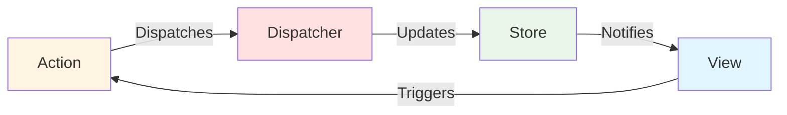
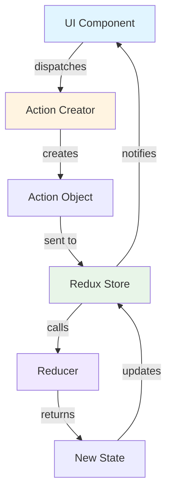

## Introduction

Redux and Flux represent a paradigm shift in how we manage application state. Used by approximately **70% of React applications**, these patterns implement unidirectional data flow with a single source of truth, making state changes predictable, debuggable, and testable. If you've ever struggled with prop drilling, inconsistent state across components, or debugging "how did we get here?" scenarios, Redux/Flux is the answer.

**Real-world examples:** Facebook (web interface), Airbnb (booking flow), Slack (channels and messages)

---

## Architecture Overview

### Flux Architecture



### Redux Architecture (Simplified Flux)



**Key Principle:** Redux removes the Dispatcher and uses pure functions (Reducers) to calculate new state.

---

## Core Concepts

### The Three Principles of Redux

```
┌─────────────────────────────────────────────────┐
│  1. Single Source of Truth                     │
│     The entire application state lives in       │
│     ONE store as a single JavaScript object     │
└─────────────────────────────────────────────────┘

┌─────────────────────────────────────────────────┐
│  2. State is Read-Only                          │
│     The ONLY way to change state is to          │
│     dispatch an action (a descriptive object)   │
└─────────────────────────────────────────────────┘

┌─────────────────────────────────────────────────┐
│  3. Changes via Pure Functions                  │
│     Reducers are pure functions:                │
│     (previousState, action) => newState         │
└─────────────────────────────────────────────────┘
```

### Unidirectional Data Flow

```
User Click
    │
    ▼
┌──────────────────┐
│  Action Created  │  { type: 'LIKE_POST', payload: { postId: '123' } }
└────────┬─────────┘
         │
         ▼
┌──────────────────┐
│   Dispatched     │  store.dispatch(action)
└────────┬─────────┘
         │
         ▼
┌──────────────────┐
│     Reducer      │  Calculates new state immutably
│  (Pure Function) │  return { ...state, posts: {...} }
└────────┬─────────┘
         │
         ▼
┌──────────────────┐
│   Store Updated  │  State tree updated
└────────┬─────────┘
         │
         ▼
┌──────────────────┐
│  Components      │  React re-renders subscribed components
│  Re-render       │  useSelector hooks pick up changes
└──────────────────┘
```

---

## State Shape: Normalized Data Structure

### Problem: Nested Data

```javascript
// ❌ Problematic: Deeply nested, hard to update
{
  posts: [
    {
      id: '1',
      content: 'Hello',
      author: {
        id: 'user-1',
        name: 'John',
        avatar: 'url'
      },
      comments: [
        {
          id: 'comment-1',
          author: { id: 'user-2', name: 'Jane' },
          text: 'Great post!'
        }
      ]
    }
  ]
}
```

### Solution: Normalized State

```javascript
// ✅ Normalized: Flat structure, easy to update
{
  entities: {
    users: {
      'user-1': { id: 'user-1', name: 'John', avatar: 'url' },
      'user-2': { id: 'user-2', name: 'Jane', avatar: 'url2' }
    },
    posts: {
      '1': { id: '1', content: 'Hello', authorId: 'user-1', commentIds: ['comment-1'] }
    },
    comments: {
      'comment-1': { id: 'comment-1', authorId: 'user-2', text: 'Great post!' }
    }
  },
  feeds: {
    home: ['1', '2', '3'],  // Just IDs
    explore: ['4', '5', '6']
  },
  ui: {
    loading: false,
    activeTab: 'home'
  }
}
```

**Visualization:**

```
State Tree (Normalized)
│
├── entities (domain data)
│   ├── users: { id → User }
│   ├── posts: { id → Post }
│   └── comments: { id → Comment }
│
├── feeds (collections of IDs)
│   ├── home: [postId1, postId2, ...]
│   └── explore: [postId3, postId4, ...]
│
├── ui (interface state)
│   ├── activeTab: 'home'
│   ├── sidebarOpen: false
│   └── loading: { posts: false }
│
└── session (user context)
    ├── currentUserId: 'user-1'
    └── isAuthenticated: true
```

---

## Real-world Implementation: Social Media Dashboard

### Use Case: Twitter-like Application

```typescript
// Action Types
enum ActionTypes {
  // Posts
  LOAD_POSTS_REQUEST = 'LOAD_POSTS_REQUEST',
  LOAD_POSTS_SUCCESS = 'LOAD_POSTS_SUCCESS',
  LOAD_POSTS_FAILURE = 'LOAD_POSTS_FAILURE',
  CREATE_POST_REQUEST = 'CREATE_POST_REQUEST',
  CREATE_POST_SUCCESS = 'CREATE_POST_SUCCESS',
  LIKE_POST = 'LIKE_POST',
  UNLIKE_POST = 'UNLIKE_POST',

  // User
  SET_CURRENT_USER = 'SET_CURRENT_USER',
  UPDATE_USER_PREFERENCES = 'UPDATE_USER_PREFERENCES',

  // UI
  SET_ACTIVE_TAB = 'SET_ACTIVE_TAB',
  TOGGLE_SIDEBAR = 'TOGGLE_SIDEBAR',
  SET_NOTIFICATION = 'SET_NOTIFICATION'
}

// State Shape (Normalized)
interface AppState {
  entities: {
    users: Record<string, User>;
    posts: Record<string, Post>;
    comments: Record<string, Comment>;
  };
  ui: {
    activeTab: 'home' | 'explore' | 'notifications' | 'profile';
    sidebarOpen: boolean;
    loading: Record<string, boolean>;
    notifications: Notification[];
  };
  session: {
    currentUserId: string | null;
    isAuthenticated: boolean;
    preferences: UserPreferences;
  };
  feeds: {
    home: string[]; // Array of post IDs
    explore: string[];
    userPosts: Record<string, string[]>; // userId -> post IDs
  };
}

// Action Creators
const postsActions = {
  loadPostsRequest: () => ({ type: ActionTypes.LOAD_POSTS_REQUEST }),

  loadPostsSuccess: (posts: Post[]) => ({
    type: ActionTypes.LOAD_POSTS_SUCCESS,
    payload: posts
  }),

  createPostSuccess: (post: Post) => ({
    type: ActionTypes.CREATE_POST_SUCCESS,
    payload: post
  }),

  likePost: (postId: string, userId: string) => ({
    type: ActionTypes.LIKE_POST,
    payload: { postId, userId }
  }),

  // Async action creator (thunk)
  loadHomeFeed: () => async (dispatch: Dispatch, getState: () => AppState) => {
    dispatch(postsActions.loadPostsRequest());

    try {
      const state = getState();
      const currentUserId = state.session.currentUserId;

      if (!currentUserId) {
        throw new Error('User not authenticated');
      }

      const posts = await api.getHomeFeed(currentUserId);
      dispatch(postsActions.loadPostsSuccess(posts));

    } catch (error) {
      dispatch({
        type: ActionTypes.LOAD_POSTS_FAILURE,
        payload: { error: error.message }
      });
    }
  },

  createPost: (content: string, imageUrl?: string) =>
    async (dispatch: Dispatch, getState: () => AppState) => {
      const state = getState();
      const currentUserId = state.session.currentUserId!;

      dispatch({ type: ActionTypes.CREATE_POST_REQUEST });

      try {
        const newPost = await api.createPost({
          content,
          imageUrl,
          userId: currentUserId
        });

        dispatch(postsActions.createPostSuccess(newPost));

        // Show success notification
        dispatch({
          type: ActionTypes.SET_NOTIFICATION,
          payload: {
            id: Date.now().toString(),
            message: 'Post created successfully!',
            type: 'success'
          }
        });

      } catch (error) {
        dispatch({
          type: ActionTypes.SET_NOTIFICATION,
          payload: {
            id: Date.now().toString(),
            message: 'Failed to create post: ' + error.message,
            type: 'error'
          }
        });
      }
    }
};

// Reducers with Immutable Updates
const entitiesReducer = (state: AppState['entities'] = initialEntitiesState, action: any): AppState['entities'] => {
  switch (action.type) {
    case ActionTypes.LOAD_POSTS_SUCCESS: {
      const posts = action.payload as Post[];
      const users = posts.map(post => post.author);

      return {
        ...state,
        posts: {
          ...state.posts,
          ...posts.reduce((acc, post) => ({ ...acc, [post.id]: post }), {})
        },
        users: {
          ...state.users,
          ...users.reduce((acc, user) => ({ ...acc, [user.id]: user }), {})
        }
      };
    }

    case ActionTypes.CREATE_POST_SUCCESS: {
      const newPost = action.payload as Post;
      return {
        ...state,
        posts: {
          ...state.posts,
          [newPost.id]: newPost
        }
      };
    }

    case ActionTypes.LIKE_POST: {
      const { postId, userId } = action.payload;
      const post = state.posts[postId];

      if (!post) return state;

      return {
        ...state,
        posts: {
          ...state.posts,
          [postId]: {
            ...post,
            likes: [...post.likes, userId],
            likeCount: post.likeCount + 1
          }
        }
      };
    }

    case ActionTypes.UNLIKE_POST: {
      const { postId, userId } = action.payload;
      const post = state.posts[postId];

      if (!post) return state;

      return {
        ...state,
        posts: {
          ...state.posts,
          [postId]: {
            ...post,
            likes: post.likes.filter(id => id !== userId),
            likeCount: post.likeCount - 1
          }
        }
      };
    }

    default:
      return state;
  }
};

const feedsReducer = (state: AppState['feeds'] = initialFeedsState, action: any): AppState['feeds'] => {
  switch (action.type) {
    case ActionTypes.LOAD_POSTS_SUCCESS: {
      const posts = action.payload as Post[];
      const postIds = posts.map(post => post.id);

      return {
        ...state,
        home: postIds
      };
    }

    case ActionTypes.CREATE_POST_SUCCESS: {
      const newPost = action.payload as Post;

      return {
        ...state,
        home: [newPost.id, ...state.home], // Add to beginning
        userPosts: {
          ...state.userPosts,
          [newPost.userId]: [
            newPost.id,
            ...(state.userPosts[newPost.userId] || [])
          ]
        }
      };
    }

    default:
      return state;
  }
};

// Selectors for derived state
const getPost = (state: AppState, postId: string) => state.entities.posts[postId];
const getUser = (state: AppState, userId: string) => state.entities.users[userId];

const getHomeFeedPosts = createSelector(
  [(state: AppState) => state.feeds.home, (state: AppState) => state.entities.posts],
  (postIds, posts) => postIds.map(id => posts[id]).filter(Boolean)
);

const getPostWithAuthor = createSelector(
  [getPost, getUser],
  (post, author) => post && author ? { ...post, author } : null
);

const getCurrentUserPosts = createSelector(
  [
    (state: AppState) => state.session.currentUserId,
    (state: AppState) => state.feeds.userPosts,
    (state: AppState) => state.entities.posts
  ],
  (currentUserId, userPosts, posts) => {
    if (!currentUserId) return [];
    const userPostIds = userPosts[currentUserId] || [];
    return userPostIds.map(id => posts[id]).filter(Boolean);
  }
);

// React Component using Redux
const HomeFeed: React.FC = () => {
  const dispatch = useDispatch();
  const homePosts = useSelector(getHomeFeedPosts);
  const loading = useSelector((state: AppState) => state.ui.loading.posts);
  const currentUserId = useSelector((state: AppState) => state.session.currentUserId);

  useEffect(() => {
    dispatch(postsActions.loadHomeFeed());
  }, [dispatch]);

  const handleLikePost = (postId: string) => {
    if (currentUserId) {
      dispatch(postsActions.likePost(postId, currentUserId));
    }
  };

  const handleCreatePost = (content: string) => {
    dispatch(postsActions.createPost(content));
  };

  if (loading) {
    return <div className="loading">Loading your feed...</div>;
  }

  return (
    <div className="home-feed">
      <CreatePostForm onSubmit={handleCreatePost} />

      <div className="posts-list">
        {homePosts.map(post => (
          <PostCard
            key={post.id}
            post={post}
            onLike={() => handleLikePost(post.id)}
            canLike={!!currentUserId}
          />
        ))}
      </div>
    </div>
  );
};

// Post Card Component
const PostCard: React.FC<PostCardProps> = ({ post, onLike, canLike }) => {
  const currentUserId = useSelector((state: AppState) => state.session.currentUserId);
  const isLiked = post.likes.includes(currentUserId || '');

  return (
    <div className="post-card">
      <div className="post-header">
        
        <div>
          <h4>{post.author.name}</h4>
          <span>{formatDate(post.createdAt)}</span>
        </div>
      </div>

      <div className="post-content">
        <p>{post.content}</p>
        {post.imageUrl && }
      </div>

      <div className="post-actions">
        <button
          onClick={onLike}
          disabled={!canLike}
          className={`like-button ${isLiked ? 'liked' : ''}`}
        >
          ❤️ {post.likeCount}
        </button>
        <button>💬 {post.commentCount}</button>
        <button>🔄 Share</button>
      </div>
    </div>
  );
};
```

---

## Immutability Patterns

### Why Immutability Matters

```javascript
// ❌ BAD: Mutating state directly
state.posts[postId].likes.push(userId);  // Redux won't detect this change!

// ✅ GOOD: Creating new objects
return {
  ...state,
  posts: {
    ...state.posts,
    [postId]: {
      ...state.posts[postId],
      likes: [...state.posts[postId].likes, userId]
    }
  }
};
```

### Common Immutable Update Patterns

```
┌─────────────────────────────────────────────────┐
│  Arrays                                         │
├─────────────────────────────────────────────────┤
│  Add:      [...array, newItem]                  │
│  Remove:   array.filter(item => item.id !== id) │
│  Update:   array.map(item =>                    │
│              item.id === id ? {...item, x} : item)│
└─────────────────────────────────────────────────┘

┌─────────────────────────────────────────────────┐
│  Objects                                        │
├─────────────────────────────────────────────────┤
│  Add/Update:  { ...obj, key: value }            │
│  Remove:      const {removed, ...rest} = obj    │
│  Nested:      { ...obj, nested: {...obj.nested, │
│                                   key: value} }  │
└─────────────────────────────────────────────────┘
```

---

## Redux DevTools: Time-Travel Debugging

```
State at Action #1  →  State at Action #2  →  State at Action #3
    (Initial)              (Post Liked)          (Comment Added)

┌───────────────┐      ┌───────────────┐      ┌───────────────┐
│ likeCount: 0  │  →   │ likeCount: 1  │  →   │ likeCount: 1  │
│ comments: []  │      │ comments: []  │      │ comments: [1] │
└───────────────┘      └───────────────┘      └───────────────┘

You can jump to ANY point in time and see the exact state!
```

---

## When to Use Redux/Flux

### ✅ Best Suited For

- **Complex state sharing** across many components (avoiding prop drilling)
- **Applications requiring time-travel debugging** (undo/redo, state inspection)
- **Real-time applications** with frequent state updates
- **Large teams** needing predictable state management patterns

### Use Cases in Production

| Company | Use Case | Why Redux |
|---------|----------|-----------|
| **Facebook** | Web interface, news feed | Complex shared state across components |
| **Airbnb** | Booking flow, search results | Multi-step process with shared data |
| **Slack** | Channels, messages, presence | Real-time updates, complex UI state |

---

## Advantages & Trade-offs

### ✅ Advantages

```
┌─────────────────────────────────────────────┐
│  Predictability                             │
│  ├─ Single source of truth                  │
│  ├─ Pure functions = same input, same output│
│  └─ Easy to trace how state changed         │
└─────────────────────────────────────────────┘

┌─────────────────────────────────────────────┐
│  Debugging & DevTools                       │
│  ├─ Time-travel debugging                   │
│  ├─ Action replay                           │
│  └─ State inspection at any point           │
└─────────────────────────────────────────────┘

┌─────────────────────────────────────────────┐
│  Testability                                │
│  ├─ Reducers are pure functions             │
│  ├─ Actions are plain objects               │
│  └─ Easy to mock and test                   │
└─────────────────────────────────────────────┘
```

### ⚠️ Trade-offs

- **Boilerplate**: Actions, action creators, reducers require more code
- **Learning Curve**: Concepts like immutability, thunks, selectors take time
- **Overkill for Simple Apps**: Not needed for small projects with minimal state

---

## Modern Alternatives

### Redux Toolkit (RTK)

```javascript
// Redux Toolkit reduces boilerplate significantly
import { createSlice } from '@reduxjs/toolkit';

const postsSlice = createSlice({
  name: 'posts',
  initialState: {},
  reducers: {
    likePost: (state, action) => {
      const post = state[action.payload.postId];
      // Immer allows "mutating" code (behind the scenes it's immutable)
      post.likes.push(action.payload.userId);
      post.likeCount += 1;
    }
  }
});
```

**Redux Toolkit** is now the recommended approach, reducing boilerplate by ~70%.

---

## Key Takeaways

1. **Unidirectional data flow** makes state changes predictable and debuggable
2. **Normalized state** prevents data duplication and makes updates efficient
3. **Immutability** is crucial - always return new objects, never mutate
4. **Selectors** compute derived data and prevent unnecessary re-renders
5. **Redux DevTools** provides time-travel debugging superpowers
6. **Redux Toolkit** dramatically reduces boilerplate in modern apps

---

## Next Steps

- **Explore Redux Toolkit** for a more ergonomic Redux experience
- **Learn Selectors** with Reselect for performance optimization
- **Combine with MVC/MVVM** - use Redux for shared state, MVVM for component-level logic
- **Try alternatives** like Zustand or Jotai for simpler state management

Redux/Flux patterns excel when your application has complex state that's shared across many components. Master these patterns, and you'll build maintainable, debuggable applications that scale with your team.
