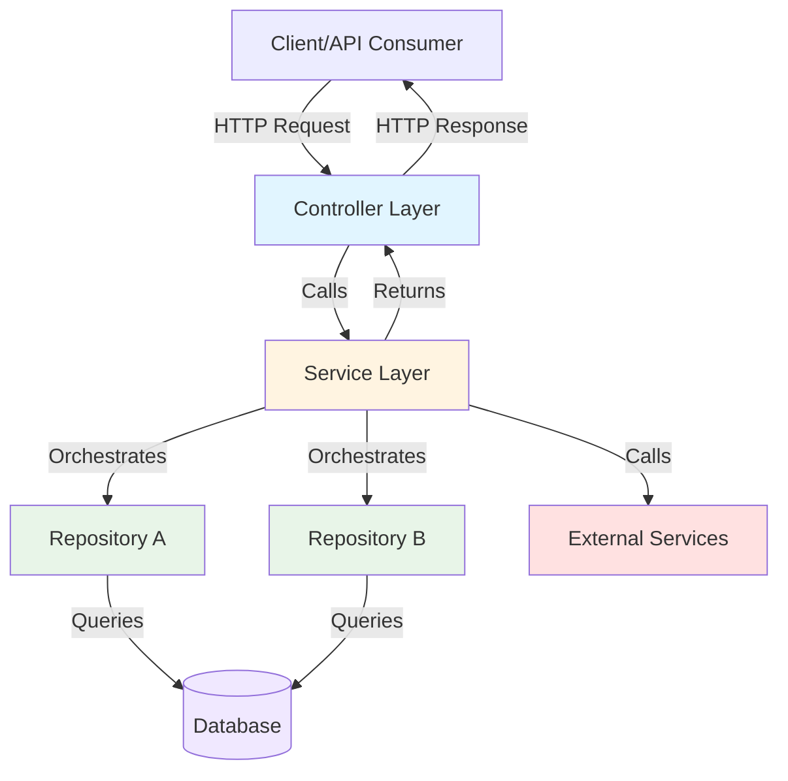

# Repository + Service Layer Pattern: Clean Architecture for Backend Systems

## Introduction

The Repository + Service Layer pattern is the backbone of approximately **80% of modern backend applications**. This combination provides a clean separation between business logic and data access, making applications highly testable, maintainable, and adaptable to changing requirements. Whether you're building an e-commerce platform, a banking system, or a SaaS application, this pattern forms the foundation of enterprise-grade architecture.

**Real-world examples:** Coursera (course management), LinkedIn Learning (content delivery), Khan Academy (learning progress tracking)

---

## Architecture Overview

### Layer Structure



### Responsibility Breakdown

```
┌─────────────────────────────────────────────────┐
│            Controller Layer                     │
│  • HTTP request/response handling               │
│  • Input validation (format)                    │
│  • DTOs ↔ Domain object mapping                 │
│  • Exception handling & status codes            │
└─────────────────────────────────────────────────┘
                      ↕
┌─────────────────────────────────────────────────┐
│            Service Layer                        │
│  • Business logic orchestration                 │
│  • Transaction management                       │
│  • Business rule enforcement                    │
│  • Multi-repository coordination                │
│  • External service integration                 │
└─────────────────────────────────────────────────┘
                      ↕
┌─────────────────────────────────────────────────┐
│            Repository Layer                     │
│  • Data access abstraction                      │
│  • CRUD operations                              │
│  • Query construction                           │
│  • Database-specific logic                      │
└─────────────────────────────────────────────────┘
                      ↕
┌─────────────────────────────────────────────────┐
│            Domain/Entity Layer                  │
│  • Business entities                            │
│  • Domain logic (validation, rules)             │
│  • Value objects                                │
└─────────────────────────────────────────────────┘
```

---

## Core Concepts

### The Repository Pattern

**Purpose:** Abstract data access logic, providing a collection-like interface for domain objects.

```java
// Repository interface (technology-agnostic)
public interface CourseRepository {
    Optional<Course> findById(String id);
    List<Course> findAll();
    Course save(Course course);
    void delete(Course course);

    // Custom query methods
    List<Course> findByInstructorId(String instructorId);
    List<Course> findByStatus(CourseStatus status);
}
```

**Benefits:**
- Decouples business logic from data access technology
- Easy to swap databases (SQL → NoSQL, MySQL → PostgreSQL)
- Testable with mock repositories
- Centralized query logic

### The Service Layer

**Purpose:** Orchestrate business operations, enforce rules, manage transactions.

```java
@Service
@Transactional
public class CourseService {
    private final CourseRepository courseRepository;
    private final EnrollmentRepository enrollmentRepository;
    private final PaymentService paymentService;

    // Business logic methods that orchestrate multiple operations
    public EnrollmentResult enrollStudent(EnrollStudentRequest request) {
        // 1. Fetch entities
        // 2. Validate business rules
        // 3. Process payment
        // 4. Create enrollment
        // 5. Send notifications
        // 6. Track analytics
    }
}
```

**Benefits:**
- Encapsulates complex business workflows
- Reusable across different controllers/endpoints
- Transaction boundaries clearly defined
- Easy to test business logic in isolation

---

## Real-world Implementation: E-learning Platform

### Use Case: Course Management and Student Enrollment

#### Request Flow Diagram

```
HTTP POST /api/courses/123/enroll
         │
         ▼
┌────────────────────────────────────────┐
│  CourseController                      │
│  • Validates HTTP request              │
│  • Extracts data from request          │
│  • Calls service layer                 │
└────────┬───────────────────────────────┘
         │
         ▼
┌────────────────────────────────────────┐
│  CourseService                         │
│  • Fetches course (CourseRepository)   │
│  • Validates business rules            │
│    ├─ Course available?                │
│    └─ Already enrolled?                │
│  • Processes payment (PaymentService)  │
│  • Creates enrollment (EnrollRepo)     │
│  • Sends notifications                 │
│  • Tracks analytics                    │
└────────┬───────────────────────────────┘
         │
         ▼
┌────────────────────────────────────────┐
│  Repository Layer                      │
│  • CourseRepository.findById()         │
│  • EnrollmentRepository.save()         │
│  • Database transactions               │
└────────┬───────────────────────────────┘
         │
         ▼
    Database
```

#### Data Flow with Multiple Repositories

```
EnrollStudent Request
        │
        ▼
    Service Layer
        │
        ├─────► CourseRepository
        │          └─ findById(courseId)
        │          └─ Returns: Course entity
        │
        ├─────► EnrollmentRepository
        │          └─ findByStudentIdAndCourseId()
        │          └─ Returns: Optional<Enrollment>
        │
        ├─────► PaymentService
        │          └─ processPayment()
        │          └─ Returns: PaymentResult
        │
        ├─────► EnrollmentRepository
        │          └─ save(newEnrollment)
        │          └─ Returns: Saved enrollment
        │
        ├─────► NotificationService
        │          └─ sendEnrollmentConfirmation()
        │
        └─────► AnalyticsService
                   └─ trackEnrollment()
```

---

## Implementation: Domain Entities

```java
// Domain Entities
@Entity
@Table(name = "courses")
public class Course {
    @Id
    private String courseId;
    private String title;
    private String description;
    private String instructorId;
    private BigDecimal price;
    private CourseStatus status;
    private LocalDateTime createdAt;
    private LocalDateTime updatedAt;

    @OneToMany(mappedBy = "course", cascade = CascadeType.ALL, fetch = FetchType.LAZY)
    private List<Lesson> lessons = new ArrayList<>();

    @OneToMany(mappedBy = "course", cascade = CascadeType.ALL, fetch = FetchType.LAZY)
    private List<Enrollment> enrollments = new ArrayList<>();

    // Business logic methods (domain logic stays in the domain)
    public boolean isPublished() {
        return this.status == CourseStatus.PUBLISHED;
    }

    public boolean canEnroll() {
        return isPublished() && this.lessons.size() > 0;
    }

    public int getTotalDuration() {
        return lessons.stream()
            .mapToInt(Lesson::getDurationMinutes)
            .sum();
    }

    public boolean hasInstructor(String instructorId) {
        return Objects.equals(this.instructorId, instructorId);
    }
}

@Entity
@Table(name = "enrollments")
public class Enrollment {
    @Id
    private String enrollmentId;
    private String studentId;
    private String courseId;
    private EnrollmentStatus status;
    private BigDecimal paidAmount;
    private LocalDateTime enrolledAt;
    private LocalDateTime completedAt;
    private int progressPercentage;

    @ManyToOne(fetch = FetchType.LAZY)
    @JoinColumn(name = "courseId", insertable = false, updatable = false)
    private Course course;

    // Business logic
    public boolean isActive() {
        return this.status == EnrollmentStatus.ACTIVE;
    }

    public boolean isCompleted() {
        return this.status == EnrollmentStatus.COMPLETED;
    }

    public void markCompleted() {
        this.status = EnrollmentStatus.COMPLETED;
        this.completedAt = LocalDateTime.now();
        this.progressPercentage = 100;
    }

    public void updateProgress(int completedLessons, int totalLessons) {
        this.progressPercentage = (int) ((completedLessons * 100.0) / totalLessons);
    }
}
```

---

## Implementation: Repository Layer

```java
// Repository Layer - Data Access Abstraction
@Repository
public interface CourseRepository extends JpaRepository<Course, String> {

    // Custom query methods
    @Query("SELECT c FROM Course c WHERE c.status = :status ORDER BY c.createdAt DESC")
    List<Course> findByStatus(@Param("status") CourseStatus status);

    @Query("SELECT c FROM Course c WHERE c.instructorId = :instructorId")
    List<Course> findByInstructorId(@Param("instructorId") String instructorId);

    @Query("""
        SELECT c FROM Course c
        WHERE LOWER(c.title) LIKE LOWER(CONCAT('%', :keyword, '%'))
           OR LOWER(c.description) LIKE LOWER(CONCAT('%', :keyword, '%'))
           AND c.status = 'PUBLISHED'
        ORDER BY c.createdAt DESC
        """)
    Page<Course> searchPublishedCourses(@Param("keyword") String keyword, Pageable pageable);

    @Query("""
        SELECT c FROM Course c
        JOIN c.enrollments e
        WHERE e.studentId = :studentId
          AND e.status = 'ACTIVE'
        ORDER BY e.enrolledAt DESC
        """)
    List<Course> findActiveCoursesForStudent(@Param("studentId") String studentId);

    // Analytics queries
    @Query("SELECT COUNT(e) FROM Enrollment e WHERE e.courseId = :courseId AND e.status = 'ACTIVE'")
    long countActiveEnrollments(@Param("courseId") String courseId);

    @Query("""
        SELECT AVG(e.progressPercentage)
        FROM Enrollment e
        WHERE e.courseId = :courseId AND e.status = 'ACTIVE'
        """)
    Double getAverageProgress(@Param("courseId") String courseId);
}

@Repository
public interface EnrollmentRepository extends JpaRepository<Enrollment, String> {

    Optional<Enrollment> findByStudentIdAndCourseId(String studentId, String courseId);

    @Query("SELECT e FROM Enrollment e WHERE e.studentId = :studentId AND e.status = :status")
    List<Enrollment> findByStudentIdAndStatus(@Param("studentId") String studentId,
                                            @Param("status") EnrollmentStatus status);

    @Query("""
        SELECT e FROM Enrollment e
        JOIN FETCH e.course c
        WHERE e.studentId = :studentId
        ORDER BY e.enrolledAt DESC
        """)
    List<Enrollment> findStudentEnrollmentsWithCourses(@Param("studentId") String studentId);

    // Business intelligence queries
    @Query("""
        SELECT new com.elearning.dto.EnrollmentStats(
            DATE(e.enrolledAt),
            COUNT(e),
            SUM(e.paidAmount)
        )
        FROM Enrollment e
        WHERE e.enrolledAt >= :startDate
        GROUP BY DATE(e.enrolledAt)
        ORDER BY DATE(e.enrolledAt)
        """)
    List<EnrollmentStats> getEnrollmentStatistics(@Param("startDate") LocalDateTime startDate);
}
```

---

## Implementation: Service Layer

```java
// Service Layer - Business Logic Orchestration
@Service
@Transactional
public class CourseService {
    private final CourseRepository courseRepository;
    private final EnrollmentRepository enrollmentRepository;
    private final PaymentService paymentService;
    private final NotificationService notificationService;
    private final AnalyticsService analyticsService;

    public CourseService(CourseRepository courseRepository,
                        EnrollmentRepository enrollmentRepository,
                        PaymentService paymentService,
                        NotificationService notificationService,
                        AnalyticsService analyticsService) {
        this.courseRepository = courseRepository;
        this.enrollmentRepository = enrollmentRepository;
        this.paymentService = paymentService;
        this.notificationService = notificationService;
        this.analyticsService = analyticsService;
    }

    public Course createCourse(CreateCourseRequest request) {
        // Business validation
        validateInstructorExists(request.getInstructorId());
        validateCourseContent(request);

        Course course = Course.builder()
            .courseId(UUID.randomUUID().toString())
            .title(request.getTitle())
            .description(request.getDescription())
            .instructorId(request.getInstructorId())
            .price(request.getPrice())
            .status(CourseStatus.DRAFT)
            .createdAt(LocalDateTime.now())
            .build();

        Course savedCourse = courseRepository.save(course);

        // Business rule: Notify instructor
        notificationService.sendCourseCreatedNotification(savedCourse);

        // Analytics
        analyticsService.trackCourseCreated(savedCourse);

        return savedCourse;
    }

    public EnrollmentResult enrollStudent(EnrollStudentRequest request) {
        // Fetch entities
        Course course = courseRepository.findById(request.getCourseId())
            .orElseThrow(() -> new CourseNotFoundException(request.getCourseId()));

        // Business validation
        if (!course.canEnroll()) {
            throw new CourseNotAvailableException("Course is not available for enrollment");
        }

        // Check for existing enrollment
        Optional<Enrollment> existingEnrollment = enrollmentRepository
            .findByStudentIdAndCourseId(request.getStudentId(), request.getCourseId());

        if (existingEnrollment.isPresent()) {
            throw new AlreadyEnrolledException("Student is already enrolled in this course");
        }

        // Process payment
        PaymentResult paymentResult = paymentService.processPayment(
            PaymentRequest.builder()
                .amount(course.getPrice())
                .currency("USD")
                .paymentMethodId(request.getPaymentMethodId())
                .studentId(request.getStudentId())
                .description("Enrollment for course: " + course.getTitle())
                .build()
        );

        if (!paymentResult.isSuccessful()) {
            throw new PaymentFailedException("Payment processing failed: " + paymentResult.getErrorMessage());
        }

        // Create enrollment
        Enrollment enrollment = Enrollment.builder()
            .enrollmentId(UUID.randomUUID().toString())
            .studentId(request.getStudentId())
            .courseId(request.getCourseId())
            .status(EnrollmentStatus.ACTIVE)
            .paidAmount(course.getPrice())
            .enrolledAt(LocalDateTime.now())
            .progressPercentage(0)
            .build();

        Enrollment savedEnrollment = enrollmentRepository.save(enrollment);

        // Business rules: Send notifications
        notificationService.sendEnrollmentConfirmation(savedEnrollment, course);
        notificationService.sendInstructorNewStudentNotification(course.getInstructorId(), savedEnrollment);

        // Analytics tracking
        analyticsService.trackEnrollment(savedEnrollment);

        return EnrollmentResult.builder()
            .enrollment(savedEnrollment)
            .paymentTransaction(paymentResult.getTransactionId())
            .build();
    }

    public CourseProgress updateStudentProgress(UpdateProgressRequest request) {
        Enrollment enrollment = enrollmentRepository
            .findByStudentIdAndCourseId(request.getStudentId(), request.getCourseId())
            .orElseThrow(() -> new EnrollmentNotFoundException("No active enrollment found"));

        if (!enrollment.isActive()) {
            throw new InactiveEnrollmentException("Cannot update progress for inactive enrollment");
        }

        Course course = courseRepository.findById(request.getCourseId())
            .orElseThrow(() -> new CourseNotFoundException(request.getCourseId()));

        // Business logic: Calculate progress
        int totalLessons = course.getLessons().size();
        int completedLessons = request.getCompletedLessons();

        enrollment.updateProgress(completedLessons, totalLessons);

        // Business rule: Auto-complete course when 100% progress
        if (enrollment.getProgressPercentage() >= 100) {
            enrollment.markCompleted();

            // Business rule: Award certificate
            certificateService.awardCertificate(enrollment.getStudentId(), course);

            // Notification
            notificationService.sendCourseCompletionNotification(enrollment, course);
        }

        enrollmentRepository.save(enrollment);

        return CourseProgress.builder()
            .enrollmentId(enrollment.getEnrollmentId())
            .progressPercentage(enrollment.getProgressPercentage())
            .isCompleted(enrollment.isCompleted())
            .completedAt(enrollment.getCompletedAt())
            .build();
    }

    @Transactional(readOnly = true)
    public List<CourseWithStats> getInstructorCourses(String instructorId) {
        List<Course> courses = courseRepository.findByInstructorId(instructorId);

        return courses.stream()
            .map(course -> {
                long activeEnrollments = courseRepository.countActiveEnrollments(course.getCourseId());
                Double averageProgress = courseRepository.getAverageProgress(course.getCourseId());

                return CourseWithStats.builder()
                    .course(course)
                    .totalEnrollments(activeEnrollments)
                    .averageProgress(averageProgress != null ? averageProgress : 0.0)
                    .totalRevenue(calculateCourseRevenue(course.getCourseId()))
                    .build();
            })
            .collect(Collectors.toList());
    }

    @Transactional(readOnly = true)
    public StudentDashboard getStudentDashboard(String studentId) {
        List<Enrollment> enrollments = enrollmentRepository
            .findStudentEnrollmentsWithCourses(studentId);

        List<Course> activeCourses = enrollments.stream()
            .filter(Enrollment::isActive)
            .map(Enrollment::getCourse)
            .collect(Collectors.toList());

        List<Course> completedCourses = enrollments.stream()
            .filter(Enrollment::isCompleted)
            .map(Enrollment::getCourse)
            .collect(Collectors.toList());

        int totalProgressPoints = enrollments.stream()
            .filter(Enrollment::isActive)
            .mapToInt(Enrollment::getProgressPercentage)
            .sum();

        return StudentDashboard.builder()
            .activeCourses(activeCourses)
            .completedCourses(completedCourses)
            .totalProgressPoints(totalProgressPoints)
            .certificatesEarned(completedCourses.size())
            .recentActivity(getRecentActivity(studentId))
            .build();
    }

    // Private helper methods for business logic
    private void validateInstructorExists(String instructorId) {
        if (!userService.isValidInstructor(instructorId)) {
            throw new InvalidInstructorException("Instructor not found or not authorized");
        }
    }

    private void validateCourseContent(CreateCourseRequest request) {
        if (request.getTitle().trim().length() < 5) {
            throw new InvalidCourseContentException("Course title must be at least 5 characters");
        }
        if (request.getPrice().compareTo(BigDecimal.ZERO) < 0) {
            throw new InvalidCourseContentException("Course price cannot be negative");
        }
    }

    private BigDecimal calculateCourseRevenue(String courseId) {
        return enrollmentRepository.findByCourseId(courseId).stream()
            .filter(e -> e.getStatus() == EnrollmentStatus.ACTIVE || e.getStatus() == EnrollmentStatus.COMPLETED)
            .map(Enrollment::getPaidAmount)
            .reduce(BigDecimal.ZERO, BigDecimal::add);
    }
}
```

---

## Implementation: Controller Layer

```java
// Controller Layer - REST API endpoints
@RestController
@RequestMapping("/api/courses")
@Validated
public class CourseController {
    private final CourseService courseService;
    private final CourseAnalyticsService analyticsService;

    public CourseController(CourseService courseService, CourseAnalyticsService analyticsService) {
        this.courseService = courseService;
        this.analyticsService = analyticsService;
    }

    @PostMapping
    public ResponseEntity<CourseDto> createCourse(@Valid @RequestBody CreateCourseRequest request) {
        Course course = courseService.createCourse(request);
        CourseDto courseDto = CourseMapper.toDto(course);

        return ResponseEntity.status(HttpStatus.CREATED)
            .location(URI.create("/api/courses/" + course.getCourseId()))
            .body(courseDto);
    }

    @PostMapping("/{courseId}/enroll")
    public ResponseEntity<EnrollmentResultDto> enrollStudent(
            @PathVariable String courseId,
            @Valid @RequestBody EnrollStudentRequest request) {

        request.setCourseId(courseId); // Set from path parameter
        EnrollmentResult result = courseService.enrollStudent(request);
        EnrollmentResultDto resultDto = EnrollmentMapper.toDto(result);

        return ResponseEntity.status(HttpStatus.CREATED).body(resultDto);
    }

    @PutMapping("/{courseId}/progress")
    public ResponseEntity<CourseProgressDto> updateProgress(
            @PathVariable String courseId,
            @Valid @RequestBody UpdateProgressRequest request) {

        request.setCourseId(courseId);
        CourseProgress progress = courseService.updateStudentProgress(request);
        CourseProgressDto progressDto = ProgressMapper.toDto(progress);

        return ResponseEntity.ok(progressDto);
    }

    @GetMapping("/instructor/{instructorId}")
    public ResponseEntity<List<CourseWithStatsDto>> getInstructorCourses(
            @PathVariable String instructorId) {
        List<CourseWithStats> courses = courseService.getInstructorCourses(instructorId);
        List<CourseWithStatsDto> courseDtos = courses.stream()
            .map(CourseMapper::toStatsDto)
            .collect(Collectors.toList());

        return ResponseEntity.ok(courseDtos);
    }

    @GetMapping("/student/{studentId}/dashboard")
    public ResponseEntity<StudentDashboardDto> getStudentDashboard(
            @PathVariable String studentId) {
        StudentDashboard dashboard = courseService.getStudentDashboard(studentId);
        StudentDashboardDto dashboardDto = DashboardMapper.toDto(dashboard);

        return ResponseEntity.ok(dashboardDto);
    }

    // Exception handlers
    @ExceptionHandler(CourseNotFoundException.class)
    public ResponseEntity<ErrorDto> handleCourseNotFound(CourseNotFoundException e) {
        ErrorDto error = ErrorDto.builder()
            .code("COURSE_NOT_FOUND")
            .message(e.getMessage())
            .timestamp(LocalDateTime.now())
            .build();

        return ResponseEntity.status(HttpStatus.NOT_FOUND).body(error);
    }

    @ExceptionHandler(AlreadyEnrolledException.class)
    public ResponseEntity<ErrorDto> handleAlreadyEnrolled(AlreadyEnrolledException e) {
        ErrorDto error = ErrorDto.builder()
            .code("ALREADY_ENROLLED")
            .message(e.getMessage())
            .timestamp(LocalDateTime.now())
            .build();

        return ResponseEntity.status(HttpStatus.CONFLICT).body(error);
    }

    @ExceptionHandler(PaymentFailedException.class)
    public ResponseEntity<ErrorDto> handlePaymentFailed(PaymentFailedException e) {
        ErrorDto error = ErrorDto.builder()
            .code("PAYMENT_FAILED")
            .message(e.getMessage())
            .timestamp(LocalDateTime.now())
            .build();

        return ResponseEntity.status(HttpStatus.PAYMENT_REQUIRED).body(error);
    }
}
```

---

## Testing Strategy

### Unit Testing: Service Layer

```java
@ExtendWith(MockitoExtension.class)
class CourseServiceTest {
    @Mock
    private CourseRepository courseRepository;

    @Mock
    private EnrollmentRepository enrollmentRepository;

    @Mock
    private PaymentService paymentService;

    @InjectMocks
    private CourseService courseService;

    @Test
    void enrollStudent_Success() {
        // Arrange
        Course course = createTestCourse();
        when(courseRepository.findById(any())).thenReturn(Optional.of(course));
        when(enrollmentRepository.findByStudentIdAndCourseId(any(), any()))
            .thenReturn(Optional.empty());
        when(paymentService.processPayment(any()))
            .thenReturn(PaymentResult.success("txn-123"));

        // Act
        EnrollmentResult result = courseService.enrollStudent(createEnrollmentRequest());

        // Assert
        assertNotNull(result.getEnrollment());
        assertEquals("txn-123", result.getPaymentTransaction());
        verify(enrollmentRepository).save(any(Enrollment.class));
    }

    @Test
    void enrollStudent_AlreadyEnrolled_ThrowsException() {
        // Arrange
        Course course = createTestCourse();
        Enrollment existingEnrollment = createTestEnrollment();
        when(courseRepository.findById(any())).thenReturn(Optional.of(course));
        when(enrollmentRepository.findByStudentIdAndCourseId(any(), any()))
            .thenReturn(Optional.of(existingEnrollment));

        // Act & Assert
        assertThrows(AlreadyEnrolledException.class, () ->
            courseService.enrollStudent(createEnrollmentRequest())
        );
    }
}
```

### Integration Testing: Repository Layer

```java
@DataJpaTest
@AutoConfigureTestDatabase(replace = AutoConfigureTestDatabase.Replace.NONE)
class CourseRepositoryTest {
    @Autowired
    private CourseRepository courseRepository;

    @Test
    void findByInstructorId_ReturnsCorrectCourses() {
        // Arrange
        Course course1 = createCourse("instructor-1");
        Course course2 = createCourse("instructor-1");
        Course course3 = createCourse("instructor-2");
        courseRepository.saveAll(List.of(course1, course2, course3));

        // Act
        List<Course> courses = courseRepository.findByInstructorId("instructor-1");

        // Assert
        assertEquals(2, courses.size());
        assertTrue(courses.stream().allMatch(c -> c.getInstructorId().equals("instructor-1")));
    }
}
```

---

## When to Use Repository + Service Pattern

### ✅ Best Suited For

- **Business-critical applications** requiring clean architecture
- **Applications with complex business rules** that need clear organization
- **Systems requiring high testability** and maintainability
- **Large teams** needing clear boundaries and separation of concerns

### Use Cases in Production

| Company | Use Case | Why This Pattern |
|---------|----------|------------------|
| **Coursera** | Course management, enrollment | Complex business workflows, multiple entities |
| **LinkedIn Learning** | Content delivery system | Service layer orchestrates complex rules |
| **Khan Academy** | Learning progress tracking | Repository abstracts data access cleanly |
| **E-commerce** | Order processing | Multi-step transactions, payment integration |
| **Banking** | Account management | Critical business rules, audit requirements |

---

## Advantages & Trade-offs

### ✅ Advantages

```
┌─────────────────────────────────────────────┐
│  Separation of Concerns                     │
│  ├─ Business logic isolated in Service      │
│  ├─ Data access isolated in Repository      │
│  └─ Easy to understand and maintain         │
└─────────────────────────────────────────────┘

┌─────────────────────────────────────────────┐
│  Testability                                │
│  ├─ Mock repositories easily                │
│  ├─ Test business logic independently       │
│  └─ Integration tests at repository level   │
└─────────────────────────────────────────────┘

┌─────────────────────────────────────────────┐
│  Database Independence                      │
│  ├─ Swap databases without changing service │
│  ├─ Multiple data sources (SQL + NoSQL)     │
│  └─ Easy to implement caching               │
└─────────────────────────────────────────────┘

┌─────────────────────────────────────────────┐
│  Reusability                                │
│  ├─ Service methods used by multiple APIs   │
│  ├─ Repository queries shared across services│
│  └─ Business logic not tied to HTTP         │
└─────────────────────────────────────────────┘
```

### ⚠️ Trade-offs

- **Boilerplate**: More interfaces and classes than simpler architectures
- **Indirection**: Extra layers can make simple operations seem complex
- **Over-abstraction**: Risk of creating unnecessary abstractions for simple CRUD

---

## Common Pitfalls

### ❌ Anemic Domain Model

```java
// BAD: All logic in service, entities are just data bags
public class Order {
    private BigDecimal total;
    private List<OrderItem> items;
    // Only getters/setters, no behavior
}

public class OrderService {
    public BigDecimal calculateTotal(Order order) {
        // Business logic in service layer
    }
}
```

### ✅ Rich Domain Model

```java
// GOOD: Domain logic in entities
public class Order {
    private BigDecimal total;
    private List<OrderItem> items;

    public BigDecimal calculateTotal() {
        return items.stream()
            .map(OrderItem::getSubtotal)
            .reduce(BigDecimal.ZERO, BigDecimal::add);
    }

    public void addItem(OrderItem item) {
        items.add(item);
        this.total = calculateTotal(); // Maintain invariant
    }
}
```

---

## Key Takeaways

1. **Repository abstracts data access** - business logic never touches database details
2. **Service layer orchestrates** - complex workflows, transaction boundaries, external services
3. **Domain entities hold business logic** - avoid anemic domain models
4. **Controllers are thin** - just HTTP concerns, delegate to services
5. **Highly testable** - mock repositories, test services independently
6. **Production-ready** - used by 80% of enterprise backend applications

---

## Next Steps

- **Explore CQRS** (Command Query Responsibility Segregation) for complex read/write patterns
- **Learn Domain-Driven Design** (DDD) for modeling complex business domains
- **Implement Caching** at the repository or service layer
- **Add Event Sourcing** for audit trails and temporal queries

The Repository + Service Layer pattern is the foundation of clean, maintainable backend architecture. Master this pattern, and you'll build systems that scale with your business complexity and team size.
